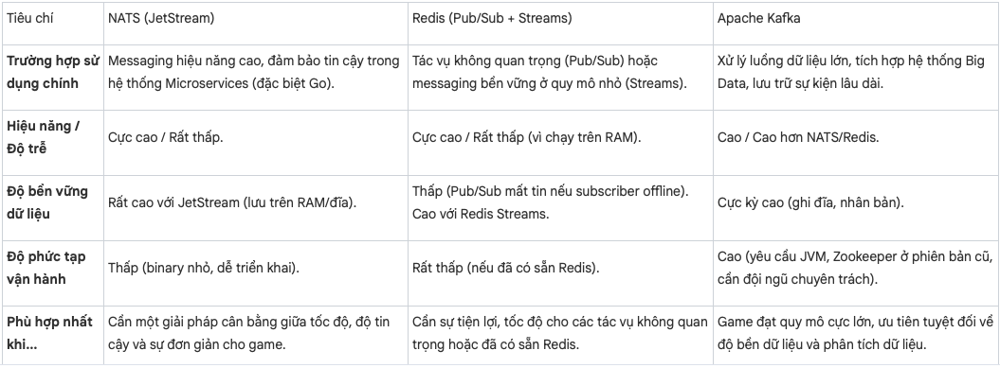
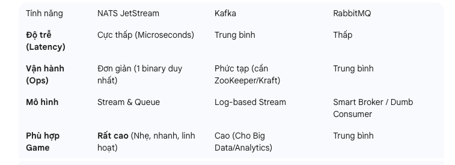

https://apidog.com/blog/best-event-streaming-solutions/

Trong phát triển Game, hệ thống Pub/Sub không dùng để đồng bộ vị trí nhân vật (Movement) do yêu cầu độ trễ cực thấp (thường dùng UDP/Reliable UDP). Thay vào đó, Pub/Sub là xương sống cho các hệ thống **Backend Services** như: Matchmaking, Chat, Inventory, Party, và Analytics.

Dưới đây là tư vấn lựa chọn dựa trên các dòng game phổ biến và kiến trúc thực tế:

### 1. Phân loại theo chức năng trong Game Server

| Chức năng | Công nghệ khuyên dùng | Lý do |
| :--- | :--- | :--- |
| **Matchmaking (Ghép trận)** | **Redis** (Pub/Sub + Sorted Set) | Cần tốc độ cực nhanh để query Elo/Point (dùng `ZSET` của Redis). Pub/Sub dùng để báo cho server biết khi room đã đủ người. |
| **Chat Global/Clan/Party** | **NATS Core** / **Redis** | Cần độ trễ thấp, fan-out (gửi 1 nhận nhiều) tốt. NATS hỗ trợ hàng triệu topics (subject) nên mỗi room/party có thể là 1 subject riêng. |
| **Inventory & Trading** | **NATS JetStream** / **RabbitMQ** | Cần độ tin cậy tuyệt đối (không mất item). JetStream hỗ trợ "Exactly-once" và transaction tốt hơn NATS Core. |
| **Game Events (Quest/Mission)**| **NATS JetStream** / **Pulsar** | Server bắn sự kiện "MonsterKilled", các service Quest, Achievement, BattlePass cùng lắng nghe để xử lý song song. |
| **Analytics (Log/Tracking)** | **Apache Kafka** / **Pulsar** | Ghi log mọi hành động người chơi để phân tích (Big Data). Cần throughput cực lớn, không cần độ trễ thấp. |

---

### 2. Kiến trúc gợi ý cho từng dòng Game

#### **A. MOBA (Liên Quân, LoL) & Battle Royale (PUBG, Free Fire)**
Đặc thù: Số lượng người chơi cực lớn (CCU cao), session ngắn, ghép trận liên tục.

* **Kiến trúc:**
    * **Matchmaking:** Dùng **Redis** để lưu hàng đợi (Queue) người chơi. Service Matchmaker quét Redis, khi ghép đủ team thì bắn event `MatchFound` qua **NATS Core** tới Game Server Manager để spawn server mới.
    * **Battle Server State:** Dùng **NATS JetStream** để lưu trạng thái trận đấu (Snapshots) định kỳ. Nếu Game Server crash, server mới có thể restore lại trận đấu từ JetStream.
    * **Lựa chọn tối ưu:** **Redis + NATS JetStream**.

#### **B. MMORPG (Võ Lâm, Genshin Impact)**
Đặc thù: Thế giới mở (Open World), dữ liệu bền vững (Persistence), giao dịch item quan trọng.

* **Kiến trúc:**
    * **World Events:** Dùng **NATS** với tính năng **Wildcard Subject**.
        * Ví dụ: Player đánh quái ở Map 1. Subject bắn ra: `game.map1.monster.die`.
        * Chỉ những service liên quan đến Map 1 hoặc Player đó mới subscribe.
    * **Item/Economy:** Bắt buộc dùng hệ thống có độ bền cao như **NATS JetStream** hoặc **Pulsar**. Không dùng Redis Pub/Sub cho giao dịch vật phẩm vì rủi ro mất dữ liệu nếu crash.
    * **Lựa chọn tối ưu:** **Apache Pulsar** (vì tính năng Multi-tenant chia channel tốt cho các Map/Zone khác nhau) hoặc **NATS JetStream**.

#### **C. Game Thẻ Tướng / Turn-based (Auto Chess, Card Game)**
Đặc thù: Không yêu cầu realtime từng mili-giây như bắn súng, logic chủ yếu nằm ở server.

* **Kiến trúc:**
    * Có thể dùng chính hệ thống Pub/Sub để điều khiển luồng game (Gameplay Loop).
    * Client gửi Action `CardPlayed` $\rightarrow$ Server tính toán $\rightarrow$ Server Publish `TurnResult` $\rightarrow$ Client hiển thị.
    * **Lựa chọn tối ưu:** **NATS Core** (nhanh, nhẹ, thay thế hoàn toàn HTTP API).

---

### 3. Tại sao NATS JetStream đang trở thành xu hướng cho Game Dev?

Hiện nay, nhiều studio game chuyển từ Kafka/RabbitMQ sang **NATS JetStream** vì 3 lý do:

1.  **Subject-based Addressing:** Bạn có thể tạo subject động như `game.vn.server1.match200.chat`. Kafka không làm được điều này (Kafka Topic rất nặng, phải tạo trước). Game cần hàng nghìn "kênh" động cho từng trận đấu/phòng chơi.
2.  **Request-Reply Pattern:** NATS hỗ trợ gọi hàm RPC cực nhanh (Client hỏi - Server trả lời) ngay trên đường truyền Pub/Sub. Giúp giảm bớt việc phải dựng thêm hệ thống gRPC/HTTP riêng.
3.  **WebSocket Tích hợp:** NATS Server có thể nhận kết nối trực tiếp từ Web/Mobile (qua WebSocket), giúp Client Game (Unity/Cocos) nhận tin nhắn trực tiếp mà không cần Gateway trung gian.

### Tổng kết

* Nếu làm **Indie/Mobile Game** vừa và nhỏ: **Redis** (cho Matchmaking/Cache) + **NATS JetStream** (cho tất cả Logic còn lại). Combo này bao phủ 90% nhu cầu.
* Nếu làm **Game AAA / Global Server** (triệu user): **Apache Pulsar** (vì khả năng Geo-replication đa vùng tốt hơn Kafka/NATS) hoặc kết hợp **Kafka** (cho Data) + **NATS** (cho Realtime).

Bạn đang dự định làm game thể loại gì? Mình có thể vẽ giúp bạn luồng data (Data Flow) cụ thể cho thể loại đó.